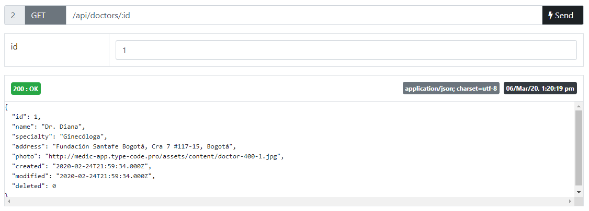
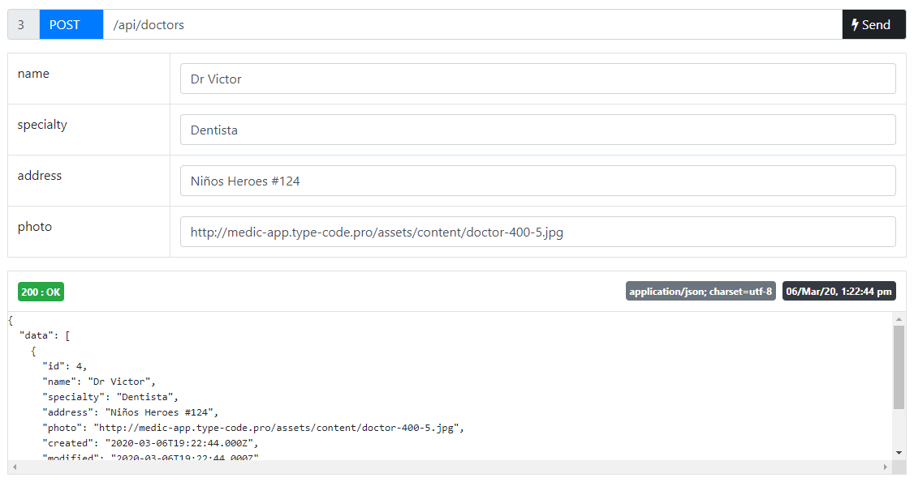
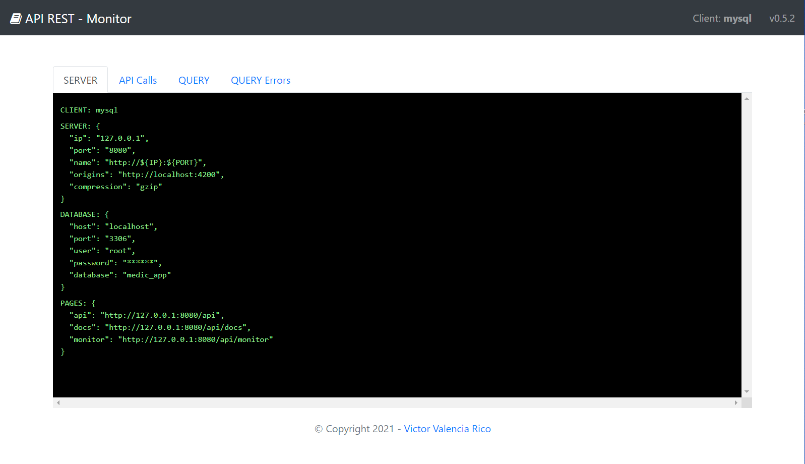

# [REST-Docs](https://github.com/victor-valencia/rest-docs)

RESTful HTTP client library + Docs to test your API REST. Supports for `PostgreSQL`, `MySQL`, `MariaDB`, `MSSQL` and `SQLite3`.


## Table of contents
- [Install](#install)
- [Install Database Library](#install-database-library)
- [Usage](#usage)
- [Usage with .env file](#usage-with-env-file)
- [Result](#result)
- [Test API](#test-api)
- [Methods](#methods)
- [Examples](#examples)
- [Author](#author)
- [License](#license)

## Install

```bash
npm i rest-docs --save
```

## Install Database Library

- `MSSQL`

```bash
npm i mssql --save
```

- `MySQL` and `MariaDB`

```bash
npm i mysql --save
```

- `PostgreSQL`

```bash
npm i pg --save
```

- `SQLite3`

```bash
npm i sqlite3 --save
```

## Usage

```javascript
// server.js
const rest_docs = require('rest-docs');
var rest = new rest_docs();

rest.startServer({
  ip: '127.0.0.1', //<-- YOUR_SERVER_IP
  port: '8080', //<-- YOUR_SERVER_PORT
  compression: 'gzip' //<-- YOUR_COMPRESSION_STRATEGY
})

rest.startDBServer('mysql', {
  host: 'localhost', //<-- YOUR_DATABASE_HOST
  port: 3306, //<-- YOUR_DATABASE_PORT
  user: 'root', //<-- YOUR_DATABASE_USER
  password: '', //<-- YOUR_DATABASE_PASSWORD
  database: 'medic' //<-- YOUR_DATABASE_NAME
});

const api_config = {
  base: '/api',
  pages: {
    docs: true, //<-- Expose PAGE: /{{base}}/docs
    monitor: true //<-- Expose PAGE: /{{base}}/monitor
  },
  routes: [
    {      
      table: 'doctors', //<-- YOUR_TABLE_NAME
      event: 'DOCTOR', //<-- YOUR_EVENT_NAME 
      methods: ['GET', 'POST', 'PUT', 'DELETE'], //<-- YOUR_METHODS
      //Used only by methods 'POST' and 'PUT'
      columns: [
          {name: 'id', primary: true},
          {name: 'name'},
          {name: 'specialty'},
          {name: 'address'},
          {name: 'photo'}
      ]
    }
  ]  
}

rest.buildRoutes(api_config)
```

Run

```bash
node server.js
# PAGES: {
#   api: 'http://127.0.0.1:8080/api',
#   docs: 'http://127.0.0.1:8080/api/docs',
#   monitor: 'http://127.0.0.1:8080/api/monitor'    
# }
# App listening at http://127.0.0.1:8080
```

## Usage with .env file

```bash
npm i dotenv --save
```

```javascript
// .env
NODE_ENV=development

IP=localhost
PORT=8000
COMPRESSION=gzip

DB_CONNECTION=mysql
DB_HOST=localhost
DB_PORT=3306
DB_USER=root
DB_PASSWORD=
DB_DATABASE=medic
```

```javascript
// server.js
const rest_docs = require('rest-docs');
var rest = new rest_docs();

rest.startServer()
rest.startDBServer();

const api_config = {
  base: '/api',
  table: {
    created_date: 'created',
    modified_date: 'modified',
    active: 'deleted'
  },
  routes: [
    {      
      table: 'doctors', //<-- YOUR_TABLE_NAME
      event: 'DOCTOR', //<-- YOUR_EVENT_NAME 
      methods: ['GET', 'POST', 'PUT', 'DELETE'], //<-- YOUR_METHODS
      //Used only by methods 'POST' and 'PUT'
      columns: [
          {name: 'id', primary: true},
          {name: 'name'},
          {name: 'specialty'},
          {name: 'address'},
          {name: 'photo'}
      ]
    }
  ]  
}

rest.buildRoutes(api_config)
```

Run

```bash
node server.js
# PAGES: {
#   api: 'http://localhost:8000/api',
#   docs: 'http://localhost:8000/api/docs',
#   monitor: 'http://localhost:8000/api/monitor'    
# }
# App listening at http://localhost:8000
```

## Result

* GET `/api/docs`


## Test API

* GET `/api/doctors`


* GET `/api/doctors/:id`



* POST `/api/doctors`



* PUT `/api/doctors/:id`


* DELETE `/api/doctors/:id`


## Pages

* Docs `/api/docs`


* Monitor `/api/monitor`



## Methods

- `startServer`(`SERVER_CONFIG`)

The `SERVER_CONFIG` represents the connection to the server.

|Constant     |Default    |Description         |
|-------------|-----------|--------------------|
|`ip`         |'localhost'|Server ip           |
|`port`       |8000       |Server port         |
|`compression`|''         |Compression strategy|

Example:

```javascript
// SERVER_CONFIG
{
  ip: {YOUR_SERVER_IP},
  port: {YOUR_SERVER_PORT},
  compression: {YOUR_COMPRESSION_STRATEGY}
}
```

- `startDBServer`(`CLIENT`, `CONNECTION_CONFIG`)

The `CLIENT` parameter is required and determines which client adapter will be used with the library. By default: `myslq`.

|Database  |CLIENT     |Additional command to install the appropriate database library|
|----------|-----------|--------------------------------------------------------------|
|MariaDB   |`myslq`    |$ npm i mysql --save                                    |
|MSSQL     |`msslq`    |$ npm i mssql --save                                    |
|MySQL     |`myslq`    |$ npm i mysql --save                                    |
|PostgreSQL|`pg`       |$ npm i pg --save                                       |
|SQLite3   |`sqlite`   |$ npm i sqlite3 --save                                  |

The `CONNECTION_CONFIG` represents the connection parameters to the database.

|Constant  |Default    |Description       |
|----------|-----------|------------------|
|`host`    |'localhost'|Database host name|
|`user`    |'root'     |Database user name|
|`password`|''         |Database password |
|`database`|'database' |Database name     |

Example:

```javascript
// CONNECTION_CONFIG
{
  host: {YOUR_DATABASE_HOST},
  user: {YOUR_DATABASE_USER},
  password: {YOUR_DATABASE_PASSWORD},
  database: {YOUR_DATABASE_NAME}
}
```

- `buildRoutes`(`API_CONFIG`)

The `API_CONFIG` represents the API configuration and its routes.

|Constant |Description         |
|---------|--------------------|
|`base`   |Main path of the API|
|`pages`  |Pages of the API|
|`table`  |Main configuration for all tables|
|`routes` |All API routes      |

Example:

```javascript
// API_CONFIG
{
  base: '/api',
  pages: {
    docs: true,
    monitor: true
  },
  table: {
    created_date: 'created',
    modified_date: 'modified',
    active: 'deleted'
  },
  routes: [
    ROUTE_CONFIG,    
    ...
  ]  
}
```

The `ROUTE_CONFIG` represents the API route group.

|Constant  |Default                                   |Description                   |
|----------|------------------------------------------|------------------------------|
|`table`   |'table'                                   |Table name                    |
|`view`    |null                                      |View name                     |
|`event`   |'TABLE'                                   |Event name<br />(For socket.io event. => 'TABLE_INSERTED', 'TABLE_UPDATED', 'TABLE_DELETED') |
|`methods` |['GET', 'POST', 'PUT', 'DELETE']          |List of methods to implement<br />['GET', 'POST', 'PUT', 'DELETE', 'SEARCH', 'SEARCH_COLUMN', 'POST_BATCH', 'PUT_BATCH', 'DELETE_BATCH']  |
|`columns` |[]                                        |List of columns<br />(Used only by methods 'POST', 'PUT', 'POST_BATCH' and  'PUT_BATCH') |

Example:

```javascript
// ROUTE_CONFIG
{      
  table: 'table',  
  view: null,
  event: 'TABLE',  
  methods: ['GET', 'POST', 'PUT', 'DELETE'],  
  columns: [
    COLUMN_CONFIG,
    ...
  ]
}
```

The `COLUMN_CONFIG` represents the column of table.

|Constant  |Default    |Description                   |
|----------|-----------|------------------------------|
|`name`    |''         |Column name                   |
|`primary` |false      |Defines if it is a primary key|

Example:

```javascript
// COLUMN_CONFIG
{
  name: 'id', 
  primary: true
}
```

## Examples

- [MySQL or MariaDB](/examples/MySQL.md).
- [PostgreSQL](/examples/PostgreSQL.md).
- [SQLite3](/examples/SQLite3.md).

## Author

@[victor-valencia](https://github.com/victor-valencia).

## License

Licensed under the [MIT license](LICENSE).